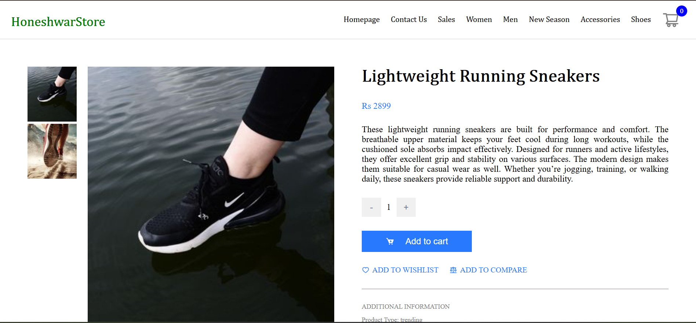
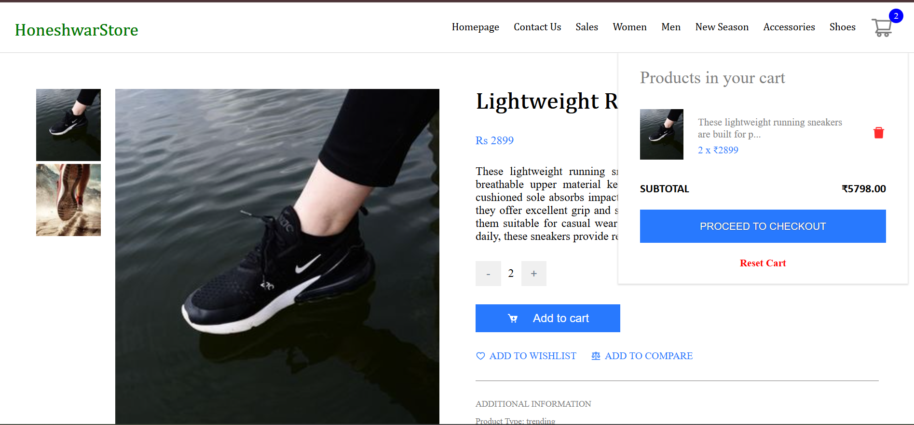
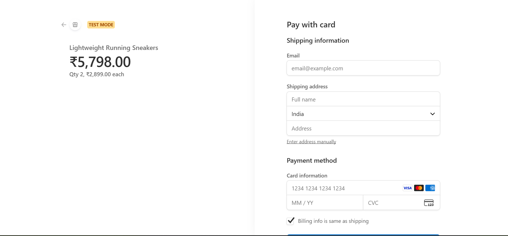
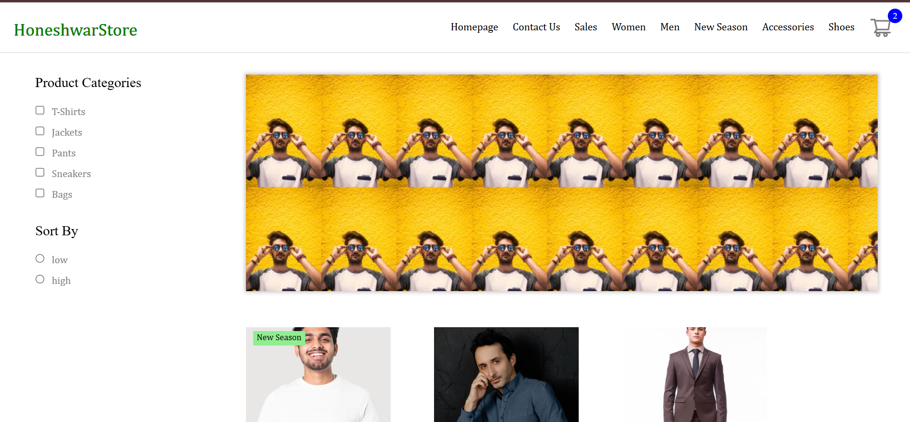

# 🛒 E-Commerce React Web Application

A modern, fast, and scalable **E-Commerce web application** built using **React + TypeScript + Vite**.  
The app provides a smooth shopping experience with product browsing, cart management, secure payments via **Stripe**, and global state handling using **Redux Toolkit**.


## 🔗 Hosted Link

- Website Link: https://honeshwar-store.netlify.app/
- Backend Service code: https://github.com/Honeshwar/ecommerce-strapi


## 📸 Screenshot

<p align="center">
  
</p>
<p align="center">
  
</p>
<p align="center">
  
</p>
<p align="center">
  
</p>
<p align="center">
  
</p>
<p align="center">
  
</p>
<p align="center">
  
</p>


## 🚀 Features

- 🧾 Product listing & details
- 🛍️ Add to cart / remove from cart
- 🔢 Quantity management
- 💳 Secure checkout using **Stripe**
- 🔔 Toast notifications for user actions
- 🌐 Client-side routing with React Router
- 🎨 Responsive UI with SASS
- ⚡ Fast build & HMR powered by Vite
- 🧠 Scalable state management using Redux Toolkit


## 🛠 Tech Stack

- **React 19 + TypeScript** (Vite)
- **Redux Toolkit** & **React Redux**
- **React Router**
- **Stripe** (Payments)
- **Axios**
- **SASS**
- **React Icons**
- **React Toastify**
- **ESLint**


## 🚀 Getting Started (Local Setup)

```bash
git clone https://github.com/Honeshwar/e-commerce-app.git
cd e-commerce-app
npm install
npm run dev
